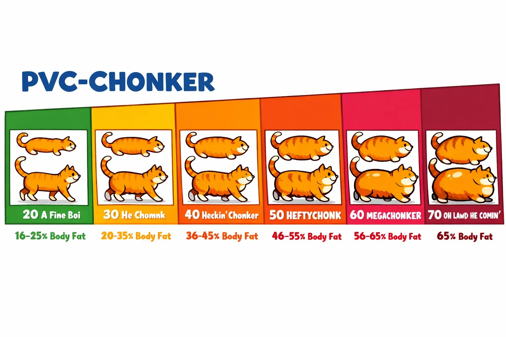

# PVC Chonker



**PVC Chonker** is a cloud-agnostic Kubernetes operator for automatic PVC expansion. Works with any CSI-compatible storage without external dependencies.

## What is PVC Chonker?

PVC Chonker automatically expands Persistent Volume Claims (PVCs) when they reach capacity thresholds, preventing storage-related outages and reducing manual intervention.

### Key Features

- **Cloud Agnostic** - Works with any CSI-compatible storage
- **No External Dependencies** - Self-contained operation
- **Annotation-Based** - Simple configuration through Kubernetes annotations
- **Policy-Based** - Advanced configuration through PVCPolicy custom resources
- **Safety Features** - Cooldown protection and resize safety checks
- **Inode Monitoring** - Monitors both storage and inode usage

## Why PVC Chonker?

### Problems It Solves

- **Storage Outages** - Prevents applications from failing due to full disks
- **Manual Intervention** - Eliminates need for manual PVC expansion
- **Capacity Planning** - Reduces operational overhead of storage management
- **Multi-Cloud** - Works consistently across different cloud providers

### Benefits

- **Proactive** - Expands before reaching 100% capacity
- **Configurable** - Flexible thresholds and expansion policies
- **Safe** - Built-in protections against rapid expansions
- **Observable** - Comprehensive metrics and logging

## Quick Start

### Installation

```bash
# Add Helm repository
helm repo add logiciq https://logiciq.github.io/helm-charts
helm repo update

# Install PVC Chonker
helm install pvc-chonker logiciq/pvc-chonker -n pvc-chonker-system --create-namespace
```

### Basic Usage

Annotate your PVC to enable auto-expansion:

```yaml
apiVersion: v1
kind: PersistentVolumeClaim
metadata:
  name: my-pvc
  annotations:
    pvc-chonker.io/enabled: "true"
    pvc-chonker.io/threshold: "80%"
    pvc-chonker.io/increase: "20%"
spec:
  accessModes: [ReadWriteOnce]
  storageClassName: your-expandable-storage-class
  resources:
    requests:
      storage: 10Gi
```

## Core Concepts

### Thresholds
- **Storage Threshold** - Percentage of storage used before expansion
- **Inode Threshold** - Percentage of inodes used before expansion
- **Dual Monitoring** - Expands when either threshold is reached

### Expansion Policies
- **Percentage-Based** - Increase by percentage (e.g., "20%")
- **Fixed Amount** - Increase by fixed size (e.g., "5Gi")
- **Minimum Scale-Up** - Ensure meaningful increases
- **Maximum Size** - Prevent unlimited growth

### Safety Features
- **Cooldown Period** - Prevents rapid successive expansions
- **Resize Detection** - Skips PVCs currently being resized
- **Size Validation** - Respects maximum size limits

## Configuration Hierarchy

PVC Chonker uses a priority-based configuration system where settings are applied in the following order (highest to lowest priority):

### 1. PVC Annotations (Highest Priority)
Direct annotations on individual PVCs always take precedence:

```yaml
apiVersion: v1
kind: PersistentVolumeClaim
metadata:
  name: my-pvc
  annotations:
    pvc-chonker.io/enabled: "true"     # Overrides all other settings
    pvc-chonker.io/threshold: "90%"     # Overrides policy/group/global
    pvc-chonker.io/increase: "50%"      # Overrides policy/group/global
spec:
  # ... PVC spec
```

### 2. PVCGroup Template (Medium-High Priority)
When a PVC matches a PVCGroup selector, group template settings apply:

```yaml
apiVersion: pvc-chonker.io/v1alpha1
kind: PVCGroup
metadata:
  name: database-group
spec:
  selector:
    matchLabels:
      app: database
  template:
    enabled: true
    threshold: "80%"    # Applied if no PVC annotation
    increase: "25%"     # Applied if no PVC annotation
```

### 3. PVCPolicy Template (Medium Priority)
Namespace-scoped policies apply to matching PVCs:

```yaml
apiVersion: pvc-chonker.io/v1alpha1
kind: PVCPolicy
metadata:
  name: default-policy
spec:
  selector:
    matchLabels:
      tier: storage
  template:
    enabled: true
    threshold: 75.0     # Applied if no annotation or group
    increase: "20%"     # Applied if no annotation or group
```

### 4. Global Configuration (Low Priority)
Operator-level defaults from flags/environment variables:

```bash
# Command line flags or environment variables
--default-threshold=70
--default-increase="15%"
--default-cooldown="10m"
```

### 5. Built-in Defaults (Lowest Priority)
Hardcoded fallback values when no other configuration exists:

- `enabled`: `false`
- `threshold`: `80%`
- `increase`: `10%`
- `cooldown`: `15m`
- `min-scale-up`: `1Gi`

### Priority Resolution Example

Given this configuration:

```yaml
# Global: threshold=70%, increase=15%
# PVCPolicy: threshold=75%, increase=20%
# PVCGroup: threshold=80%, increase=25%
# PVC Annotation: threshold=90%

# Final effective configuration:
# threshold: 90% (from PVC annotation - highest priority)
# increase: 25% (from PVCGroup - highest available)
# cooldown: 15m (from global default)
```

**Key Points:**
- PVC annotations always win
- PVCGroup templates override PVCPolicy templates
- Only specified fields override lower priorities
- Unspecified fields fall through to next priority level

## Configuration Methods

### 1. Annotations (Simple)
Direct configuration on individual PVCs:

```yaml
annotations:
  pvc-chonker.io/enabled: "true"
  pvc-chonker.io/threshold: "85%"
  pvc-chonker.io/increase: "25%"
```

### 2. PVCPolicy (Advanced)
Centralized policies for multiple PVCs:

```yaml
apiVersion: pvc-chonker.io/v1alpha1
kind: PVCPolicy
metadata:
  name: database-policy
spec:
  selector:
    matchLabels:
      workload: database
  template:
    enabled: true
    threshold: 85.0
    increase: "25%"
```

### 3. PVCGroup (Coordinated)
Synchronized expansion across related PVCs:

```yaml
apiVersion: pvc-chonker.io/v1alpha1
kind: PVCGroup
metadata:
  name: elasticsearch-cluster
spec:
  selector:
    matchLabels:
      app: elasticsearch
  coordinationPolicy: "largest"
```

## Getting Started

- **[Installation Guide](./guides/installation.md)** - Install PVC Chonker in your cluster
- **[Quick Start](./guides/quick-start.md)** - Get up and running in 5 minutes
- **[Annotation Reference](./guides/annotations.md)** - Complete annotation documentation
- **[Configuration Examples](./examples/configuration-examples.md)** - Real-world usage patterns

## Use Cases

- **[Database Storage](./examples/database-storage.md)** - Auto-expanding database volumes
- **[Log Storage](./examples/log-storage.md)** - Managing log volume growth
- **[Application Data](./examples/application-data.md)** - General application storage
- **[Multi-Tenant](./examples/multi-tenant.md)** - Policy-based tenant storage

## Advanced Features

- **[Metrics & Monitoring](./guides/metrics.md)** - Prometheus metrics and alerting
- **[PVCPolicy](./guides/pvcpolicy.md)** - Advanced policy configuration
- **[PVCGroup](./guides/pvcgroup.md)** - Coordinated expansion
- **[Troubleshooting](./guides/troubleshooting.md)** - Common issues and solutions

## Community

- **GitHub**: [LogicIQ/pvc-chonker](https://github.com/LogicIQ/pvc-chonker)
- **Issues**: [Report bugs and request features](https://github.com/LogicIQ/pvc-chonker/issues)
- **Discussions**: [Community discussions](https://github.com/LogicIQ/pvc-chonker/discussions)